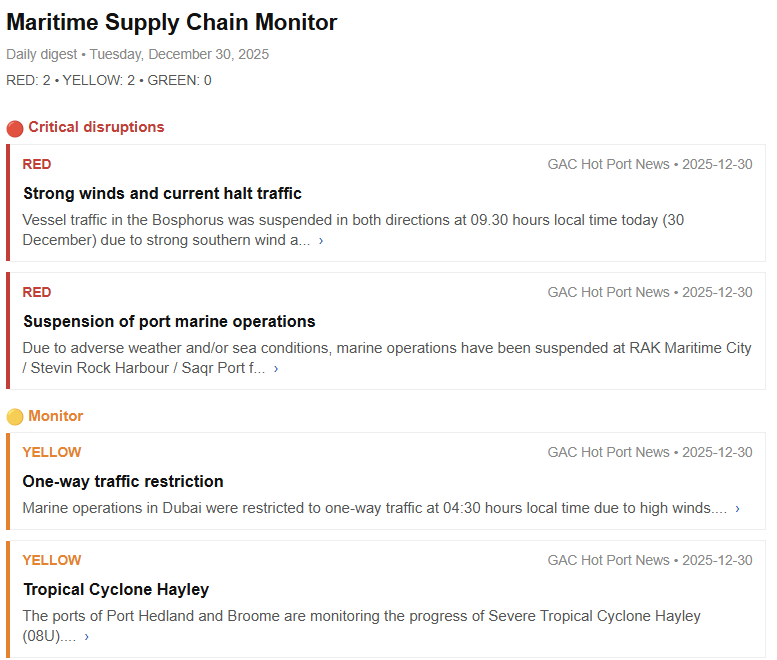

# Maritime Supply Chain Monitor

Automated n8n workflow that monitors maritime disruptions and emails daily intelligence reports.

## What It Does

- Aggregates maritime news from specialized industry sources
- Classifies by severity using AI (RED/YELLOW/GREEN)
- Removes duplicates automatically
- Stores in Airtable
- Sends HTML email digest

## Features

- Multi-source data ingestion (RSS, APIs, web scraping)
- Batch AI processing (20 articles/call)
- URL-based deduplication (95%+ efficiency)
- Daily automated reports

## Setup

1. **Import workflow** into n8n
2. **Create Airtable base** with tables: `Articles` and `Users`
3. **Add credentials** in n8n:
   - Airtable token (with read/write/delete permissions)
   - OpenRouter API key
   - SMTP (for email)
4. **Replace placeholders** in workflow nodes
5. **Run once** to test, then activate schedule

## Requirements

- n8n (self-hosted or cloud)
- Airtable account (free tier works)
- OpenRouter API key (free tier: 50 requests/day)

## License

MIT
